# scope-clock

A rewrite of the SCTV Scope Clock firmware as a **thin vector-rendering client**
with an NTP-disciplined RTC, plus an **ESP32-S3 Wi-Fi bridge** (M5Stack AtomS3U).

Derivative of [nixiebunny/SCTVcode](https://github.com/nixiebunny/SCTVcode)
(David Forbes / Cathode Corner), **GPL-2.0-or-later**.

## Layout

    scope-clock/
    ├─ scope-clock.code-workspace   ← open this in VS Code (multi-root)
    ├─ shared/protocol.h            ← single source of truth for the wire protocol
    ├─ display-teensy/              ← the thin client (Teensy 3.6 + DS3232 + CRT)
    └─ bridge-esp32/                ← Wi-Fi bridge (ESP32-S3 / AtomS3U)

## Prerequisites

1. VS Code + the **PlatformIO IDE** extension.
2. Teensy flashing: install **Teensyduino**; on Linux add the `49-teensy.rules` udev rules.
3. ESP32 needs nothing extra — the `espressif32` platform is fetched by PlatformIO.

## Build

Open the workspace, then per project use the PlatformIO toolbar (Build ✓ / Upload →),
or the CLI:

    cd display-teensy && pio run            # build
    cd display-teensy && pio run -t upload   # flash (board plugged in)

    cd bridge-esp32   && pio run
    cd bridge-esp32   && pio run -t upload

## Status

**The roadmap is complete and running on hardware.** Forty-seven built-in faces
draw from the DS3232; the ESP32 bridge disciplines the RTC from NTP over a
USB-host link with no wiring; the host can push arbitrary vector scenes,
banners, and *face templates* that keep telling the time on their own; and the
clock appears in Home Assistant over MQTT discovery with controls, diagnostics
and device triggers.

The knob walks the fifteen families — dials, digital, solids, curves, motion,
wireframes, the sky and the rest — and the button changes the style within one.

### Every face

Rendered by compiling the firmware's own `vector.cpp` against a fake DAC and
integrating the dots with a decay, which is what phosphor does — so these are
the real geometry and the real beam path, not mock-ups, but they are renders
rather than photographs of the tube. Each clip runs three seconds at the speed
the clock runs, and the second hand is really ticking. Faces drawn from pushed
data show sample data.

<!-- FACES:BEGIN -->

| | | | | | |
|:-:|:-:|:-:|:-:|:-:|:-:|
| 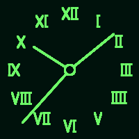 **hands** Analog | 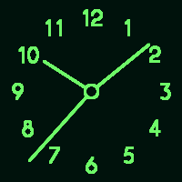 **numbers** Analog | 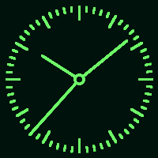 **tickdial** Analog | 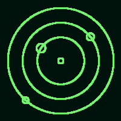 **orbit** Analog | 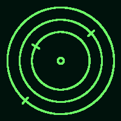 **sector** Analog | 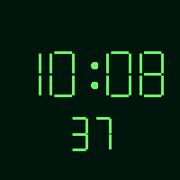 **digital** Digital |
| 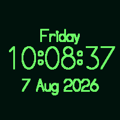 **datetime** Digital | 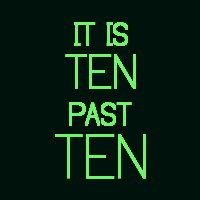 **wordclock** Digital | 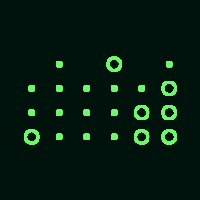 **binary** Digital | 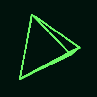 **tetra** Solids | 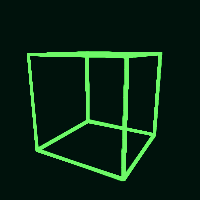 **cube** Solids | 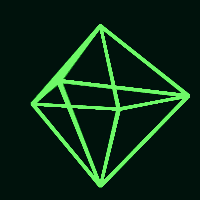 **octa** Solids |
| 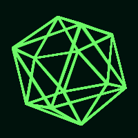 **icosa** Solids | 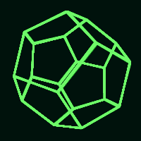 **dodeca** Solids | 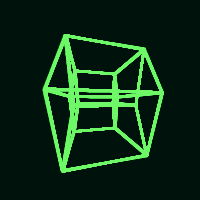 **tesseract** Solids | 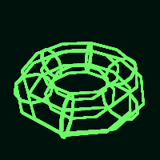 **torus** Solids | 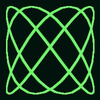 **lissajous** Curves | 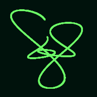 **harmonograph** Curves |
| 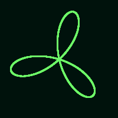 **spirograph** Curves | 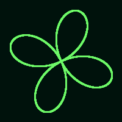 **rose** Curves | 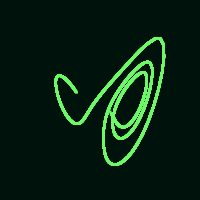 **lorenz** Curves | 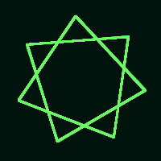 **starpoly** Curves | 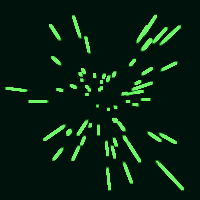 **starfield** Motion | 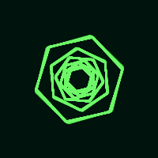 **tunnel** Motion |
| 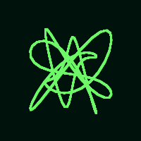 **midiscope** MIDI | 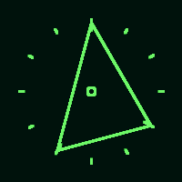 **midichord** MIDI | 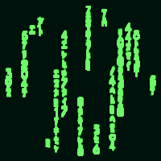 **matrix** Effects | 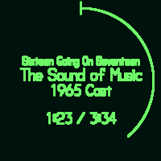 **nowplaying** Data | 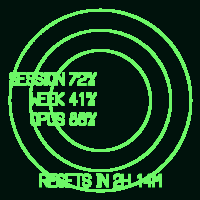 **gauges** Data | 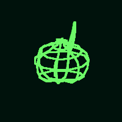 **teapot** Wireframes |
| 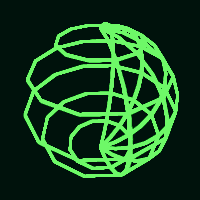 **sphere** Wireframes | 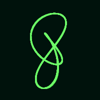 **knot** Wireframes | 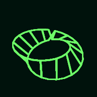 **mobius** Wireframes | 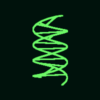 **helix** Wireframes | 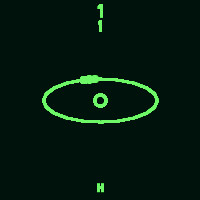 **atom** Science | 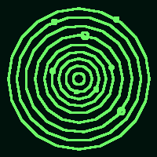 **solar** Sky |
| 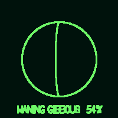 **moon** Sky | 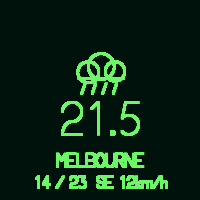 **weather** Sky | 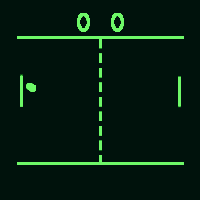 **pong** Games | 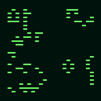 **life** Games | 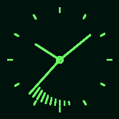 **trailclock** Extra | 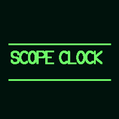 **ticker** Extra |
| 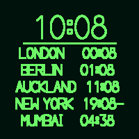 **worldclock** Extra | 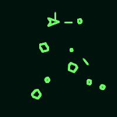 **asteroids** Arcade | 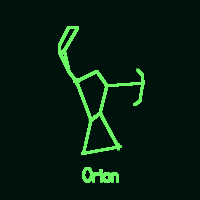 **constell** Stars | 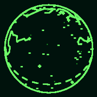 **starglobe** Stars |  |  |

<!-- FACES:END -->

Regenerate with `python3 tools/gen_gallery.py` after adding a face. Two further faces are driven live over
**USB-MIDI** on the front jack: `midiscope` plots the lower note against the
upper, so an interval draws its own frequency ratio the way an oscilloscope in
X-Y mode does (a fifth is the 3:2 figure), and `midichord` shows the sounding
pitch classes as a shape on the chromatic wheel. `tools/play_midi.py --demo`
walks the intervals if there is no keyboard to hand.

### Without the bridge

The clock is autonomous: all 46 faces live on the Teensy and render from the
DS3232, the knob and button work locally, and nothing in boot or the render loop
waits on the link. Unplug the bridge and it keeps time and keeps drawing.

**Hold the knob's button for 2.5 seconds for the settings menu** — past the 0.8s
that enters size mode. Turn to move, tap to select: set time, set date, face
size, typeface, burn-in drift, info, exit. The editors take three fields each —
turn to change, tap for the next, the last tap commits — and an edit you walk
away from expires after 30s without changing anything.

A setting is in that menu if changing it means something with no bridge
attached. Wi-Fi, MQTT and the rest stay on the config page.

The config page carries a **link trace**: every frame between the two MCUs in
both directions, decoded, newest last. Both arrows moving means the link is
healthy; only inbound moving is the one-way failure this hardware is prone to,
and it shows there before any symptom reaches the tube.

The config page also has **centring**, which shifts the whole image on top of
the trimmer pots inside the case, and a **target** face of concentric rings to
set it against. The outer ring sits on the tube's usable radius, so it should
touch the glass all the way round when the picture is centred.

What the bridge adds is NTP (and therefore summer time, which the device never
reasons about), persistence for the per-face sizes and the other settings, the
five host-fed faces — `weather`, `ticker`, `worldclock`, `nowplaying`, `gauges` —
and everything networked: MQTT, Home Assistant, pushed scenes and the config
page.

The bridge also serves a config page at `http://scope-clock-bridge.local/`
(guarded by the OTA password) for setting Wi-Fi, MQTT and timezone without
rebuilding.

| phase | what | state |
|-------|------|-------|
| P0 | render engine: vectors, stroke font, RTC | done |
| P1 | framed link, real CRC, encoder/button, NTP `SET_TIME` | done |
| P2 | `PushList` + `Banner` — true thin client | done |
| P3 | MQTT / Home Assistant on the bridge | done |
| P4 | face templates, web config | done |

Flashing: `pio run -t upload` in `display-teensy/`, and
`pio run -e atoms3u_ota -t upload` in `bridge-esp32/` (over Wi-Fi).
Copy `bridge-esp32/.env.example` to `.env` and fill it in first.

## Licence

Copyright (C) 2026 Kayden D'Mello.
Derived from [SCTVcode](https://github.com/nixiebunny/SCTVcode),
Copyright (C) 2008-2022 David Forbes (Cathode Corner).

This program is free software; you can redistribute it and/or modify it under
the terms of the GNU General Public License as published by the Free Software
Foundation; **either version 2 of the License, or (at your option) any later
version**. It is distributed in the hope that it will be useful, but WITHOUT ANY
WARRANTY; without even the implied warranty of MERCHANTABILITY or FITNESS FOR A
PARTICULAR PURPOSE. See [`LICENSE`](LICENSE) for the full text.
