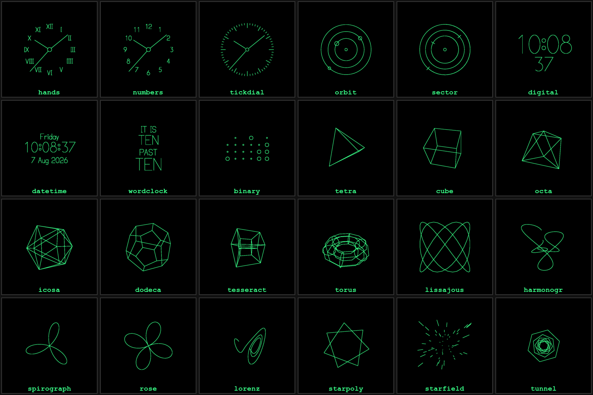

# scope-clock

A rewrite of the SCTV Scope Clock firmware as a **thin vector-rendering client**
with an NTP-disciplined RTC, plus an **ESP32-S3 Wi-Fi bridge** (M5Stack AtomS3U).

Derivative of [nixiebunny/SCTVcode](https://github.com/nixiebunny/SCTVcode)
(David Forbes / Cathode Corner), **GPL-2.0-or-later**.

## Layout

    scope-clock/
    ├─ scope-clock.code-workspace   ← open this in VS Code (multi-root)
    ├─ shared/protocol.h            ← single source of truth for the wire protocol
    ├─ display-teensy/              ← the thin client (Teensy 3.6 + DS3232 + CRT)
    └─ bridge-esp32/                ← Wi-Fi bridge (ESP32-S3 / AtomS3U)

## Prerequisites

1. VS Code + the **PlatformIO IDE** extension.
2. Teensy flashing: install **Teensyduino**; on Linux add the `49-teensy.rules` udev rules.
3. ESP32 needs nothing extra — the `espressif32` platform is fetched by PlatformIO.

## Build

Open the workspace, then per project use the PlatformIO toolbar (Build ✓ / Upload →),
or the CLI:

    cd display-teensy && pio run            # build
    cd display-teensy && pio run -t upload   # flash (board plugged in)

    cd bridge-esp32   && pio run
    cd bridge-esp32   && pio run -t upload

## Status

**The roadmap is complete and running on hardware.** Twenty-six built-in faces
draw from the DS3232; the ESP32 bridge disciplines the RTC from NTP over a
USB-host link with no wiring; the host can push arbitrary vector scenes,
banners, and *face templates* that keep telling the time on their own; and the
clock appears in Home Assistant over MQTT discovery with controls, diagnostics
and device triggers.

The knob walks the five families — dials, digital, solids, curves, motion — and
the button changes the style within one. Two further faces are driven live over
**USB-MIDI** on the front jack: `midiscope` plots the lower note against the
upper, so an interval draws its own frequency ratio the way an oscilloscope in
X-Y mode does (a fifth is the 3:2 figure), and `midichord` shows the sounding
pitch classes as a shape on the chromatic wheel. `tools/play_midi.py --demo`
walks the intervals if there is no keyboard to hand.

The bridge also serves a config page at `http://scope-clock-bridge.local/`
(guarded by the OTA password) for setting Wi-Fi, MQTT and timezone without
rebuilding.

| phase | what | state |
|-------|------|-------|
| P0 | render engine: vectors, stroke font, RTC | done |
| P1 | framed link, real CRC, encoder/button, NTP `SET_TIME` | done |
| P2 | `PushList` + `Banner` — true thin client | done |
| P3 | MQTT / Home Assistant on the bridge | done |
| P4 | face templates, web config | done |

Flashing: `pio run -t upload` in `display-teensy/`, and
`pio run -e atoms3u_ota -t upload` in `bridge-esp32/` (over Wi-Fi).
Copy `bridge-esp32/.env.example` to `.env` and fill it in first.

## Licence

Copyright (C) 2026 Kayden D'Mello.
Derived from [SCTVcode](https://github.com/nixiebunny/SCTVcode),
Copyright (C) 2008-2022 David Forbes (Cathode Corner).

This program is free software; you can redistribute it and/or modify it under
the terms of the GNU General Public License as published by the Free Software
Foundation; **either version 2 of the License, or (at your option) any later
version**. It is distributed in the hope that it will be useful, but WITHOUT ANY
WARRANTY; without even the implied warranty of MERCHANTABILITY or FITNESS FOR A
PARTICULAR PURPOSE. See [`LICENSE`](LICENSE) for the full text.
